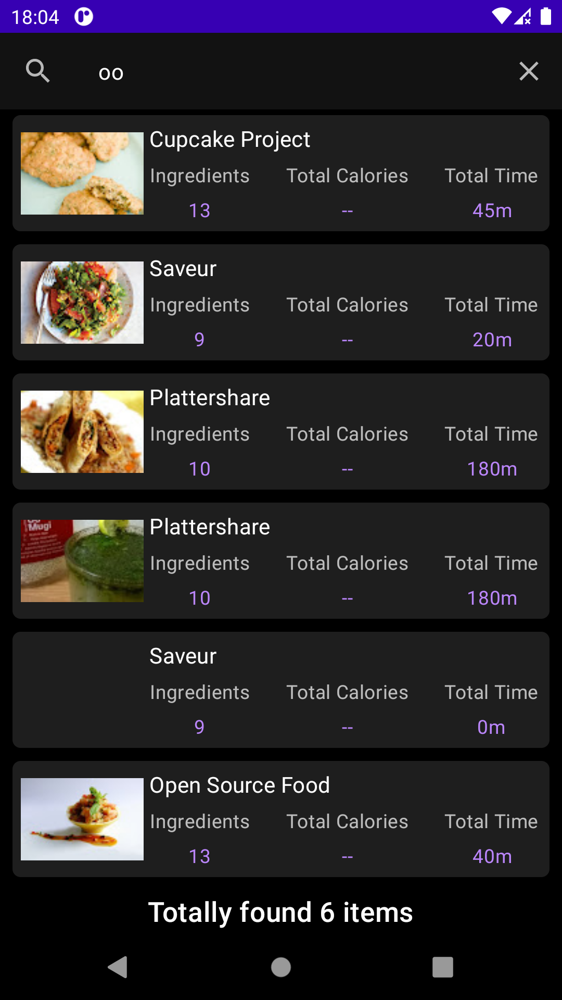

# Yummly Search

## Requirements
Create an Android app that uses [Yummly API](https://developer.yummly.com/documentation.html) to allow users to search Yummly recipes.:
1. Implemented using Kotlin with an architecture of your choice (MVC, MVP, MVVM, etc.)
2. Provides a search experience
3. Supports infinite scrolling, meaning the app should search for the next results page
   when the user scrolls to the bottom of the list.
4. Includes an empty search result page. Searches that return zero recipes should show
   a page that tells the user there are no results.

## Additional Work (Myself)
1. Supports portrait and landscape modes
2. Provides Light and Dark theme

## Build system
### Environment
Android Studio Chipmunk | 2021.2.1 Patch 1

## Screenshots
### Search Screen
|  |  |  |
|:---:|:---:|:---:|
|Portrait Search| Landscape Search | Dark Mode|

### Recipe Details Screen
Not completed it.
